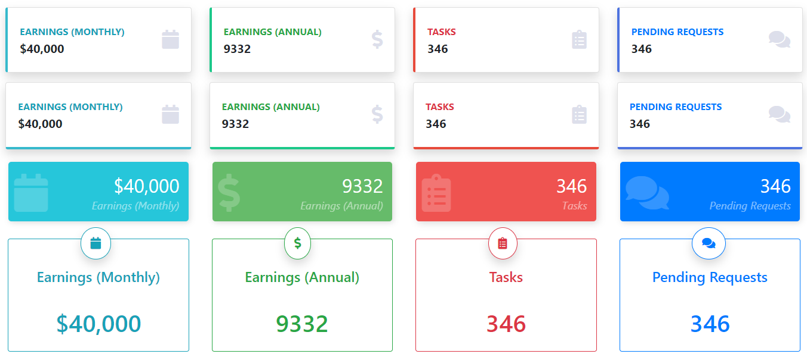

<!-- README.md is generated from README.Rmd. Please edit that file -->

# summaryBox

<!-- badges: start -->

<!-- badges: end -->

The objective of this package is to add value / info boxes in shiny and
Rmarkdown (bootstrap 4). Value and Info Boxes are very popular to
display insights in colorful boxes, they are available in
`shinydashboard` package but not in shiny and Rmarkdown.

## Installation

You can install the released version of summaryBox from Github with:

``` r
# install.packages("remotes")
remotes::install_github("deepanshu88/summaryBox")
```

## Example

This is a basic example which shows you how to solve a common problem:

``` r
library(shiny)
library(summaryBox)

# Bootstrap 4
theme <- bslib::bs_theme(version = 4)

# UI
ui <- fluidPage(

  theme = theme,

  br(),

  fluidRow(

    summaryBox("Earnings (Monthly)", "$40,000", width = 3, icon = "fas fa-calendar", style = "info"),
    summaryBox("Earnings (Annual)", "9332", width = 3, icon = "fas fa-dollar-sign", style = "success"),
    summaryBox("Tasks", "346", width = 3, icon = "fas fa-clipboard-list", style = "danger"),
    summaryBox("Pending Requests", "346", width = 3, icon = "fas fa-comments", style = "primary")

  ),

  fluidRow(

    summaryBox("Earnings (Monthly)", "$40,000", width = 3, icon = "fas fa-calendar", style = "info", border = "bottom"),
    summaryBox("Earnings (Annual)", "9332", width = 3, icon = "fas fa-dollar-sign", style = "success", border = "bottom"),
    summaryBox("Tasks", "346", width = 3, icon = "fas fa-clipboard-list", style = "danger", border = "bottom"),
    summaryBox("Pending Requests", "346", width = 3, icon = "fas fa-comments", style = "primary", border = "bottom")

  ),


  fluidRow(
    summaryBox2("Earnings (Monthly)", "$40,000", width = 3, icon = "fas fa-calendar", style = "info"),
    summaryBox2("Earnings (Annual)", "9332", width = 3, icon = "fas fa-dollar-sign", style = "success"),
    summaryBox2("Tasks", "346", width = 3, icon = "fas fa-clipboard-list", style = "danger"),
    summaryBox2("Pending Requests", "346", width = 3, icon = "fas fa-comments", style = "primary")
  ),

  br(),

  # Info Box
  fluidRow(
    summaryBox3("Earnings (Monthly)", "$40,000", width = 3, icon = "fas fa-calendar", style = "info"),
    summaryBox3("Earnings (Annual)", "9332", width = 3, icon = "fas fa-dollar-sign", style = "success"),
    summaryBox3("Tasks", "346", width = 3, icon = "fas fa-clipboard-list", style = "danger"),
    summaryBox3("Pending Requests", "346", width = 3, icon = "fas fa-comments", style = "primary")
  )

)

# Server
server <- function(input, output, session) {


}

# Run App
shinyApp(ui = ui, server = server)
#> 
#> Listening on http://127.0.0.1:3921
```


